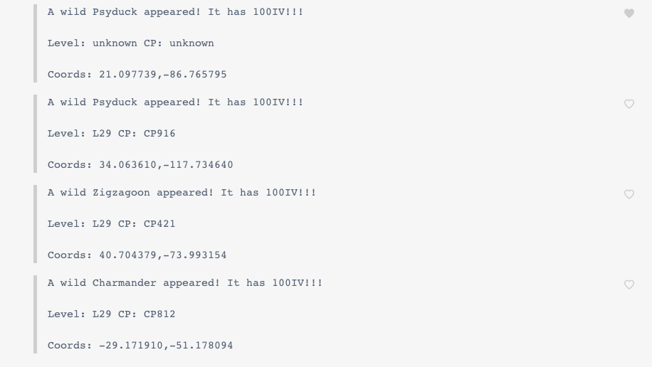

# ivbot
Pokemon Go Twitter Bot for 100IV

## About
Wanted to try out getting 100IV pokemon via you know; somewhat non legit methods.

## Bot.py
Scrapes twitter every 5 mins and posts message somewhere

## Config for Twitter
Set variables in a environment file
```bash
cp envfile_sample envfile
source envfile
python bot.py
```

## Config for Custom Pokemon
Maybe you only want certain 100IV pokemon. You can override the current list by
setting *POKEMON_FILE* in your environment with the path to a json file that 
contains a array of pokemon names.

### Example
```json
[
  "Bulbasaur",
  "Charmander"
]
```

## Config for Minimum CP
Unsure why you would want this but whatever.
```bash
export MIN_CP=1000
```

## Config for Minimum Level
Much more useful option.
```bash
export MIN_LEVEL=35
```

## Running Tests
```bash
(venv) mharris@liberty:ivbot $ ./test.sh 
================================================================================ test session starts =================================================================================
platform darwin -- Python 3.7.1, pytest-4.1.1, py-1.7.0, pluggy-0.8.1 -- /Users/mharris/Working/projects/ivchecker/venv/bin/python
cachedir: .pytest_cache
rootdir: /Users/mharris/Working/projects/ivchecker/ivbot, inifile:
collected 14 items                                                                                                                                                                   

test/test_bot.py::test_check_min PASSED                                                                                                                                        [  7%]
test/test_bot.py::test_check_dupe PASSED                                                                                                                                       [ 14%]
test/test_bot.py::test_get_pokemon_names PASSED                                                                                                                                [ 21%]
test/test_bot.py::test_is_likely_pokemon_related PASSED                                                                                                                        [ 28%]
test/test_bot.py::test_format_content PASSED                                                                                                                                   [ 35%]
test/test_bot.py::test_get_name PASSED                                                                                                                                         [ 42%]
test/test_bot.py::test_get_cp PASSED                                                                                                                                           [ 50%]
test/test_bot.py::test_get_level PASSED                                                                                                                                        [ 57%]
test/test_bot.py::test_get_coordinates PASSED                                                                                                                                  [ 64%]
test/test_bot.py::test_get_no_name PASSED                                                                                                                                      [ 71%]
test/test_bot.py::test_get_no_cp PASSED                                                                                                                                        [ 78%]
test/test_bot.py::test_get_no_level PASSED                                                                                                                                     [ 85%]
test/test_bot.py::test_get_no_coordinates PASSED                                                                                                                               [ 92%]
test/test_bot.py::test_check_bad_min PASSED 
```

## Example Output
This is for group me but should easily be modified for whatever communication
method you prefer.


